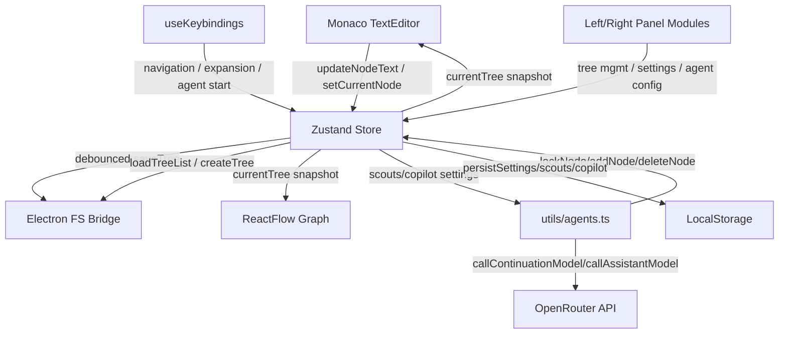

# Dataflow

## Overview
Helm uses a unidirectional data flow anchored in the Zustand store (`src/store.ts`). UI components read slices of state through `useStore` and dispatch mutations via store actions. Long-running agent tasks call the same action set, so the renderer thread is the single source of truth.

## Editor ↔ Tree Synchronization
1. When `currentTree.currentNodeId` changes, `TextEditor` recomputes the branch text via `getBranchText` and sets Monaco's model (`TextEditor.tsx` hooks).
2. User edits trigger `updateNodeText` updates, which mutate the node inside the Map and reschedule the save debounce timer.
3. Keyboard commands (split, merge, mass merge, expand) call the corresponding store actions. Many of these actions mutate the `Tree` in place before cloning the Map to satisfy React change detection.

## Tree ↔ Graph View
- `GraphContent` subscribes to the same `currentTree` reference. On each render it transforms nodes and edges into ReactFlow elements and runs Dagre layout. It stores viewport state to avoid unnecessary re-centering. When agents mutate the tree, the graph redraws with the new topology.

## Agent Messages ↔ Store
- Agent modules receive callbacks to `lockNode`, `unlockNode`, `addNode`, `deleteNode`, `mergeWithParent`, and `addScoutOutput`.
- Cancellation uses shared mutable refs in the Agents panel; `shouldStop` closures consult those refs so long-running `async` loops can exit gracefully.
- Copilot output is appended to `copilot.outputs`, giving the UI immediate access to the last response.

## OpenRouter Interaction
- Both manual and autonomous expansion paths feed through `callContinuationModel` / `callAssistantModel`, which enforce retries and return plain strings. The calling context is responsible for parsing decision tags (Scout/Witness/Copilot) or applying completions (expand).

## Undo / Redo Model
- Helm currently lacks global undo/redo. Operations mutate the `Tree` in place and overwrite the persisted JSON. To restore state, users must rely on manual bookmarks, exports, or OS-level backups.
