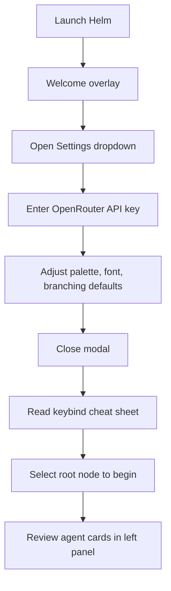
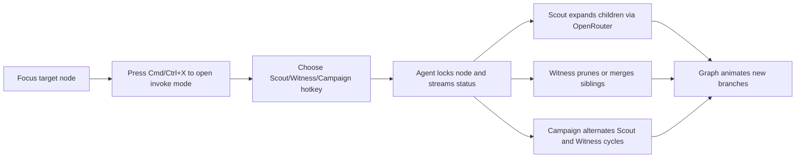
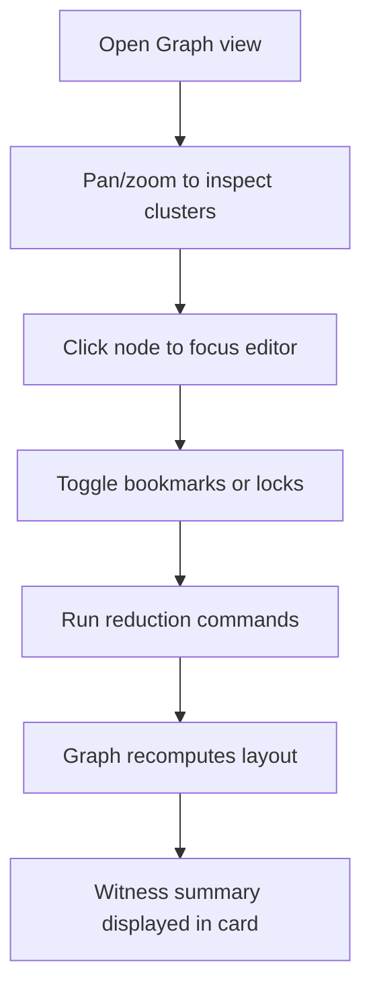

# Helm User Flows

## Onboarding Sequence

## Initiating Autonomous Exploration

## Editing While Agents Explore
1. User keeps cursor in Monaco editor, refining the active branch.
2. Background Scout threads append children to the selected node without stealing focus.
3. Copilot card displays live commentary; user can accept or reject cull/expand suggestions.
4. Keybindings (e.g., split node, mass merge) remain available even during agent runs unless a lock blocks the target.

## Tree and Graph Interaction

## Transition to Synthesis
1. Pause active agents via stop controls when tree density peaks.
2. Use Cull & Merge to Bookmarks to compress exploratory dead ends.
3. Trigger Copilot sweep to evaluate surviving branches.
4. Merge critical leaves upward, shaping a linear narrative in Monaco.
5. Export or snapshot the refined tree as the final articulation.
