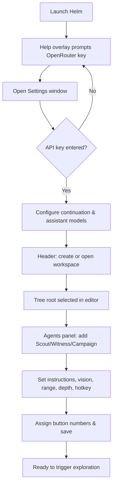
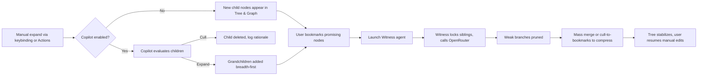
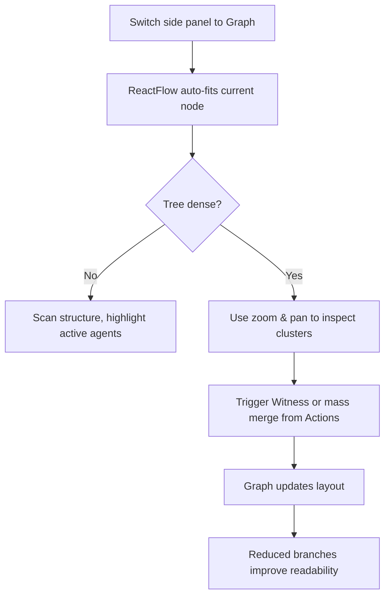
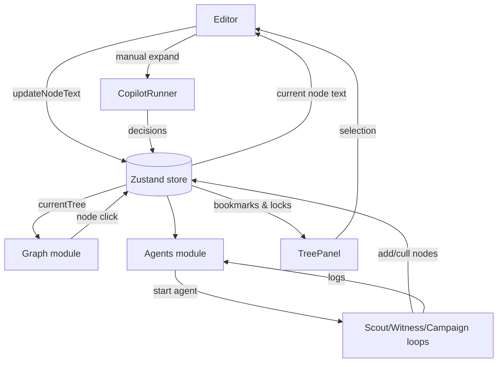
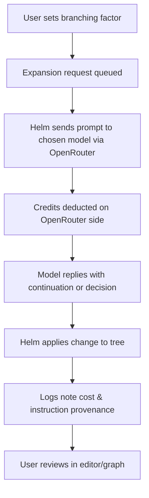

# Helm Interaction Model Map

## Session Kickoff & Agent Configuration

## Branching, Pruning, and Recovery

## Graph Inspection & Complexity Reduction

## Feedback Loops Across Surfaces

## OpenRouter Integration in Everyday Terms

