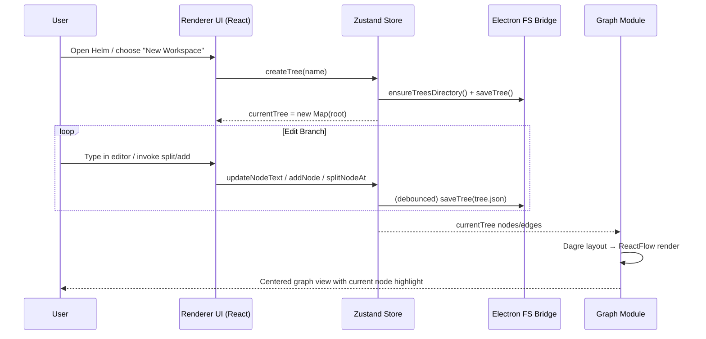
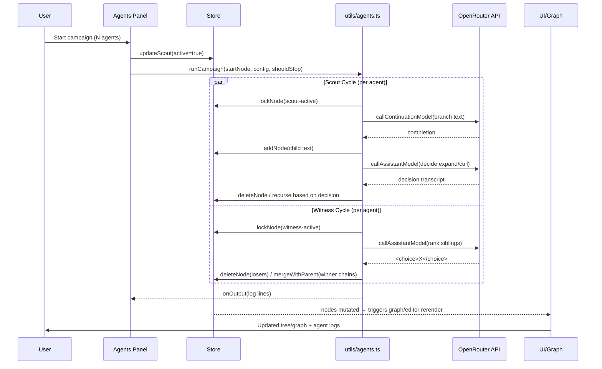
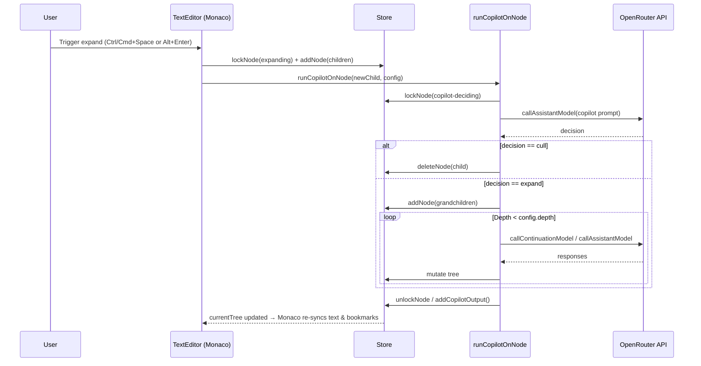
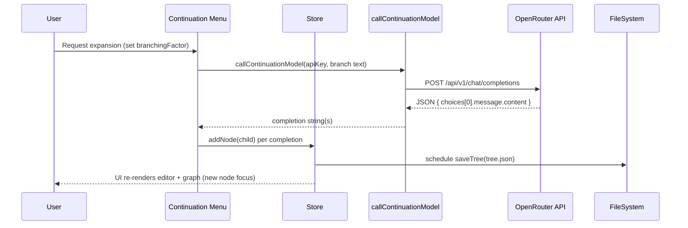

# Runtime Sequences

## Create Workspace → Populate Tree → Visualize Graph

## Launch Autonomous Exploration with N Agents

## Edit Text with Copilot Active

## OpenRouter Query → Streaming Response → UI Update → Persistence

> **Timing & Cost Notes**
> - `withRetry` in `openrouter.ts` retries up to 3 times with exponential backoff (1s, 2s, 4s) before surfacing errors.
> - `Promise.all` fan-out in `expandNode` issues `branchingFactor` parallel OpenRouter calls per expansion; large branching factors amplify latency and credit usage.
> - Saves are debounced by 500 ms; `flushTreeSave()` runs synchronously on tree switches and before the window unloads.
