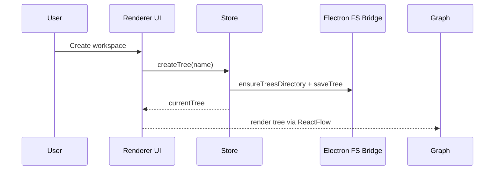
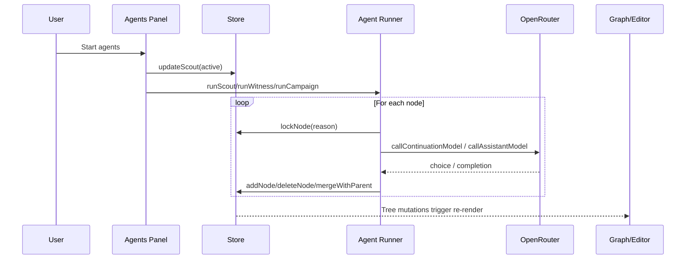
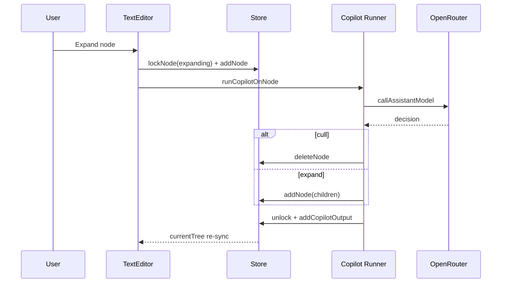
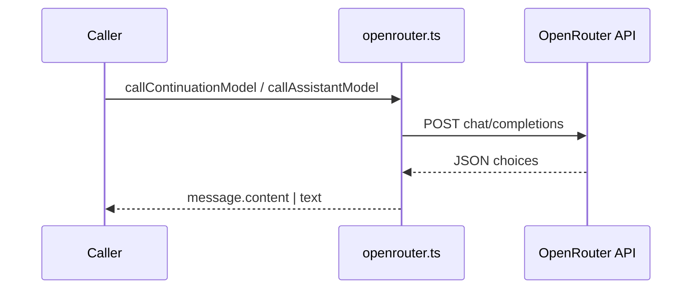

# Runtime Sequence Diagrams

## Workspace Creation

```mermaid
sequenceDiagram
    participant U as User
    participant UI as Renderer UI
    participant ST as Store
    participant FS as Electron FS Bridge
    participant GR as Graph
    U->>UI: Create workspace
    UI->>ST: createTree(name)
    ST->>FS: ensureTreesDirectory + saveTree
    ST-->>UI: currentTree
    UI-->>GR: render tree via ReactFlow
```

## Autonomous Exploration

```mermaid
sequenceDiagram
    participant U as User
    participant AP as Agents Panel
    participant ST as Store
    participant AG as Agent Runner
    participant OR as OpenRouter
    participant UI as Graph/Editor
    U->>AP: Start agents
    AP->>ST: updateScout(active)
    AP->>AG: runScout/runWitness/runCampaign
    loop For each node
        AG->>ST: lockNode(reason)
        AG->>OR: callContinuationModel / callAssistantModel
        OR-->>AG: choice / completion
        AG->>ST: addNode/deleteNode/mergeWithParent
    end
    ST-->>UI: Tree mutations trigger re-render
```

## Copilot Editing

```mermaid
sequenceDiagram
    participant U as User
    participant TE as TextEditor
    participant ST as Store
    participant AG as Copilot Runner
    participant OR as OpenRouter
    U->>TE: Expand node
    TE->>ST: lockNode(expanding) + addNode
    TE->>AG: runCopilotOnNode
    AG->>OR: callAssistantModel
    OR-->>AG: decision
    alt cull
        AG->>ST: deleteNode
    else expand
        AG->>ST: addNode(children)
    end
    AG->>ST: unlock + addCopilotOutput
    ST-->>TE: currentTree re-sync
```

## OpenRouter Request Lifecycle

```mermaid
sequenceDiagram
    participant Caller
    participant ORC as openrouter.ts
    participant OR as OpenRouter API
    Caller->>ORC: callContinuationModel / callAssistantModel
    ORC->>OR: POST chat/completions
    OR-->>ORC: JSON choices
    ORC-->>Caller: message.content | text
```
