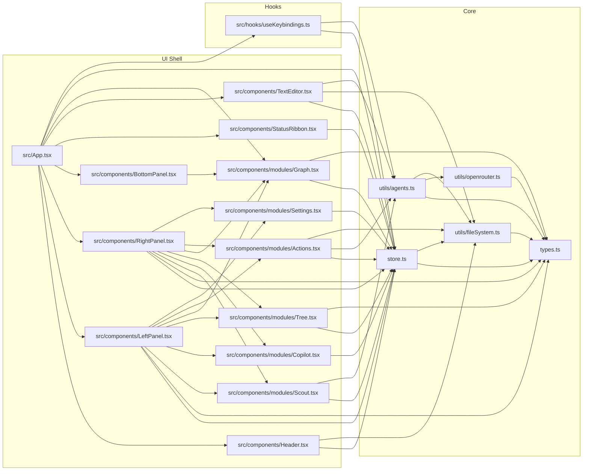

# Module Dependency Graph

```mermaid
graph LR
    subgraph Core
        Store[store.ts]
        Types[types.ts]
        AgentsUtils[utils/agents.ts]
        OpenRouter[utils/openrouter.ts]
        FileSystem[utils/fileSystem.ts]
    end

    subgraph UI Shell
        App[src/App.tsx]
        Header[src/components/Header.tsx]
        LeftPanel[src/components/LeftPanel.tsx]
        RightPanel[src/components/RightPanel.tsx]
        BottomPanel[src/components/BottomPanel.tsx]
        StatusRibbon[src/components/StatusRibbon.tsx]
        TextEditor[src/components/TextEditor.tsx]
        GraphModule[src/components/modules/Graph.tsx]
        TreeModule[src/components/modules/Tree.tsx]
        ScoutModule[src/components/modules/Scout.tsx]
        CopilotModule[src/components/modules/Copilot.tsx]
        ActionsModule[src/components/modules/Actions.tsx]
        SettingsModule[src/components/modules/Settings.tsx]
    end

    subgraph Hooks
        Keybindings[src/hooks/useKeybindings.ts]
    end

    App --> Header
    App --> LeftPanel
    App --> RightPanel
    App --> BottomPanel
    App --> StatusRibbon
    App --> TextEditor
    App --> GraphModule
    App --> Store
    App --> Keybindings

    Header --> Store
    Header --> FileSystem

    LeftPanel --> Store
    LeftPanel --> Types
    LeftPanel --> ScoutModule
    LeftPanel --> CopilotModule
    LeftPanel --> TreeModule
    LeftPanel --> GraphModule
    LeftPanel --> ActionsModule
    LeftPanel --> SettingsModule

    RightPanel --> Store
    RightPanel --> Types
    RightPanel --> ScoutModule
    RightPanel --> CopilotModule
    RightPanel --> TreeModule
    RightPanel --> GraphModule
    RightPanel --> ActionsModule
    RightPanel --> SettingsModule

    BottomPanel --> GraphModule
    StatusRibbon --> Store

    TextEditor --> Store
    TextEditor --> FileSystem
    TextEditor --> AgentsUtils

    GraphModule --> Store
    GraphModule --> Types

    TreeModule --> Store
    TreeModule --> Types

    ScoutModule --> Store
    ScoutModule --> AgentsUtils

    CopilotModule --> Store

    ActionsModule --> Store
    ActionsModule --> AgentsUtils
    ActionsModule --> FileSystem

    SettingsModule --> Store

    Keybindings --> Store
    Keybindings --> AgentsUtils

    AgentsUtils --> Types
    AgentsUtils --> OpenRouter
    AgentsUtils --> FileSystem

    FileSystem --> Types
    OpenRouter --> Types
    Store --> Types
    Store --> FileSystem
```

> _Note_: Static SVG generation is not included because Mermaid CLI is unavailable in this environment.
